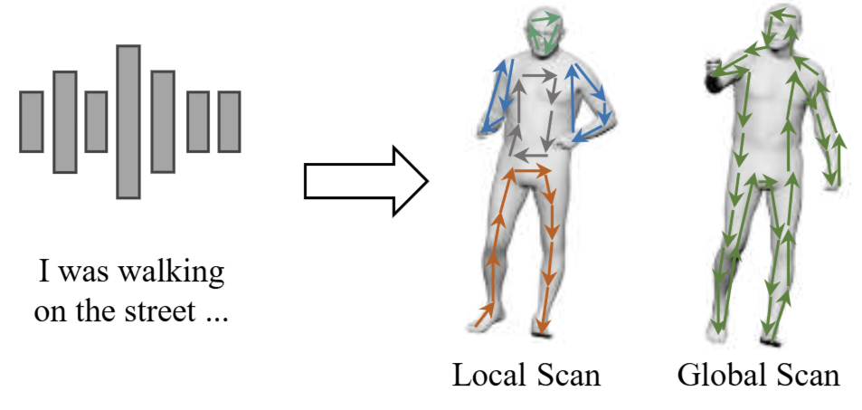

I am currently a second-year Ph.D. student at Shenzhen International Graduate School, Tsinghua University supervised by Prof. Xiu Li. 
<!-- Prior to that, I received my Master from Northeastern University (China) under the supervision of Assoc. Prof. Lu Meng.  -->
I'm passion about human-centric topics, including <strong>human motion and interaction synthesis, motion modelling, 3D vison, and Generative Model</strong>. 

_______________________________________________________________________________________________________
<h3>
   🆕News
</h3>

  <ul>
  <li> <strong>[Dec 2024]</strong> One first-author paper about long dance generation accepted by CVPR 2024!</li>
  <li> <strong>[Dec 2023]</strong> One first-author paper about controllable dance generation accepted by ICASSP 2024!</li>
  <li> <strong>[Dec 2023]</strong> Two papers about 3D object grounding and gestures generation are accepted by AAAI 2024!</li>
  <li> <strong>[Jul 2023]</strong> One first-author paper about music driven dance generation accepted by ICCV 2023!</li>
  </ul>

_______________________________________________________________________________________________________

[Please visit [my google scholar profile](https://scholar.google.com/citations?hl=en&user=h1PooycAAAAJ) for the full publication list.]

<h3>
   ✨Selected Publications
</h3>

        <table cellspacing="0" cellpadding="0" class="noBorder">
           <tbody>
                <tr>
                    <td width="40%">
                        
                            </td>
                    <td>
                            <b>Lodge: A Coarse to Fine Diffusion Network for Long Dance Generation Guided by the Characteristic Dance Primitives</b>
                     
                    <strong>Ronghui Li</strong>, Yuxiang Zhang, Yachao Zhang, Yachao Zhang, Hongwen Zhang, Jie Guo, Yan Zhang, Yebin Liu, Xiu Li.
                     
                    <em>IEEE/CVF Conference on Computer Vision and Pattern Recognition (CVPR 2024)</em>
                     
                    [<a href="https://li-ronghui.github.io/lodge">Project</a>][<a href="http://arxiv.org/abs/2403.10518">Paper</a>][<a href="https://github.com/li-ronghui/LODGE">Code</a>]
                    </td>
                </tr>
                <tr>
                    <td width="40%">
                        
                            </td>
                    <td>
                            <b>FineDance: A Fine-grained Choreography Dataset for 3D Full Body Dance Generation</b>
                     
                    <strong>Ronghui Li</strong>, Junfan Zhao,  Yachao Zhang, Mingyang Su, Zeping Ren, Han Zhang, Yansong Tang, Xiu Li.
                     
                    <em>IEEE/CVF Conference on International Conference on Computer Vision (ICCV 2023)</em>
                     
                    [<a href="https://li-ronghui.github.io/finedance">Project</a>][<a href="https://arxiv.org/abs/2212.03741">Paper</a>][<a href="https://github.com/li-ronghui/FineDance">Code</a>]
                    </td>
                </tr>
                <tr>
                    <td width="40%">
                        
                            </td>
                    <td>
                            <b>Exploring Multi-Modal Control in Music-Driven Dance Generation</b>
                     
                    <strong>Ronghui Li</strong>, Yuqin Dai, Yachao Zhang, Jun Li, Jian Yang, Jie Guo, Xiu Li.
                     
                    <em>IEEE International Conference on Acoustics, Speech and Signal Processing
 (ICASSP 2024)</em>
                     
                    [<a href="https://arxiv.org/abs/2401.01382">Paper</a>]
                    </td>
                </tr>
                <tr>
                    <td width="40%">
                        
                            </td>
                    <td>
                            <b>Harmonious Group Choreography with Trajectory-Controllable Diffusion</b>
                     
                    Yuqin Dai, Wanlu Zhu, <strong>Ronghui Li</strong>, Zeping Ren, Xiangzheng Zhou, Xiu Li, Jun Li1, Jian Yan.
                     
                    <em>arXiv preprint arXiv:2403.06189 (arXiv)</em>
                     
                    [<a href="https://wanluzhu.github.io/TCDiffusion/">Project</a>][<a href="https://arxiv.org/abs/2403.06189">Paper</a>][<a href="https://github.com/Da1yuqin/TCDiff">Code Comming</a>]
                    </td>
                </tr>
                <tr>
                    <td width="40%">
                        
                            </td>
                    <td>
                          <b>Text2Avatar: Text to 3D Human Avatar Generation with Codebook-Driven Body Controllable Attribute</b>
                     
                    Chaoqun Gong, Yuqin Dai, <strong>Ronghui Li</strong>, Achun Bao, Jun Li, Jian Yang, Yachao Zhang, Xiu Li.
                     
                    <em>IEEE International Conference on Acoustics, Speech and Signal Processing
 (ICASSP 2024)</em>
                     
                    [<a href="https://browse.arxiv.org/abs/2401.00711">Paper</a>]
                    </td>
                </tr>
                <tr>
                    <td width="40%">
                        
                            </td>
                    <td>
                            <b>Cross-Modal Match for Language Conditioned 3D Object Grounding</b>
                     
                    Yachao Zhang, Runze Hu, <strong>Ronghui Li</strong>, Yanyun Qu, Yuan Xie, Xiu Li.
                     
                    <em>Association for the Advance of Artificial Intelligence (AAAI 2024)</em>
                     
                    [<a href="https://github.com/li-ronghui">Paper</a>]
                    </td>
                </tr>
               <tr>
                    <td width="40%">
                        
                            </td>
                    <td>
                            <b>Chain of Generation: Multi-Modal Gesture Synthesis via Cascaded Conditional Control</b>
                     
                     Zunnan Xu，Yachao Zhang，Sicheng Yang，<strong>Ronghui Li</strong>，Xiu Li.
                     
                    <em>Association for the Advance of Artificial Intelligence (AAAI 2024)</em>
                     
                   [<a href="https://arxiv.org/abs/2312.15900">Paper</a>]
                    </td>
               </tr>
               <tr>
                    <td width="40%">
                        
                            </td>
                    <td>
                            <b>MambaTalk: Efficient Holistic Gesture Synthesis with Selective State Space Models</b>
                     
                    Zunnan Xu, Yukang Lin, Haonan Han, Sicheng Yang, <strong>Ronghui Li</strong>, Yachao Zhang, Xiu Li.
                     
                    <em>arXiv preprint arXiv:2403.09471 (arXiv)</em>
                     
                    [<a href="https://arxiv.org/abs/2403.09471">Paper</a>]
                    </td>
                </tr>
                    </tbody>
           </table>

<!-- [Please visit [my google scholar profile](https://scholar.google.com/citations?hl=en&user=h1PooycAAAAJ) for the full publication list.] -->

_______________________________________________________________________________________________________

<!-- <h3>
   🚩Academic Services
</h3>

  <ul>
  <li> <strong>Emergency Conference Reviewer</strong>: CVPR </li>
  <li> <strong>Journal Reviewer</strong>: International Journal of Human-Computer Interaction (IJHCI)</li>
  </ul>

 -->